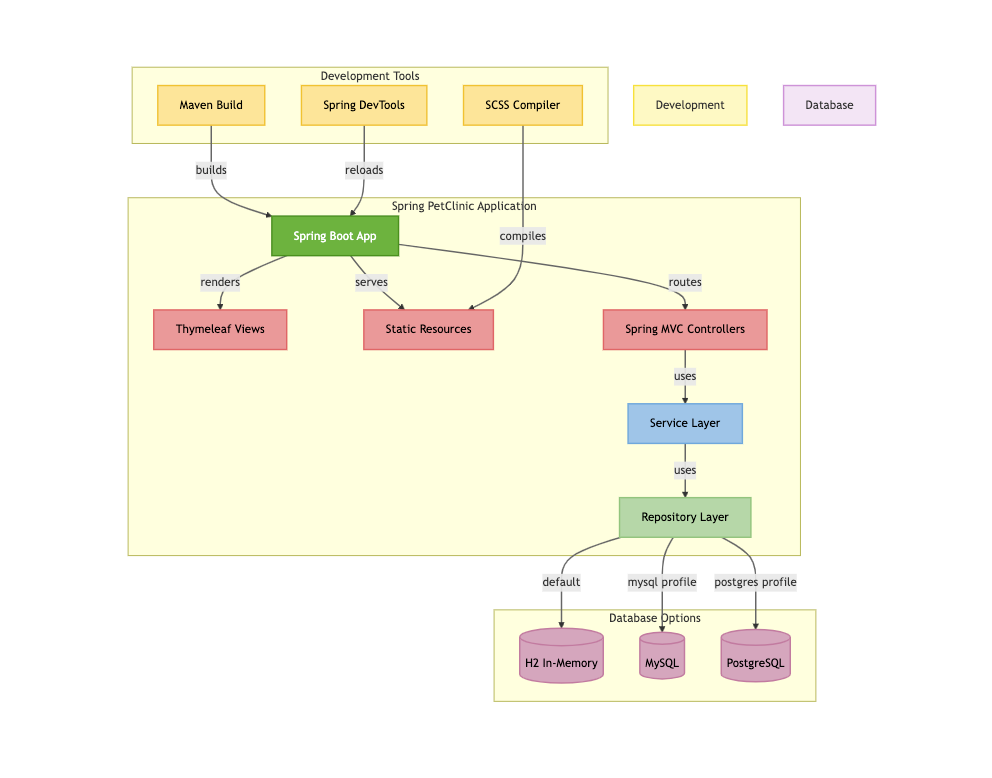
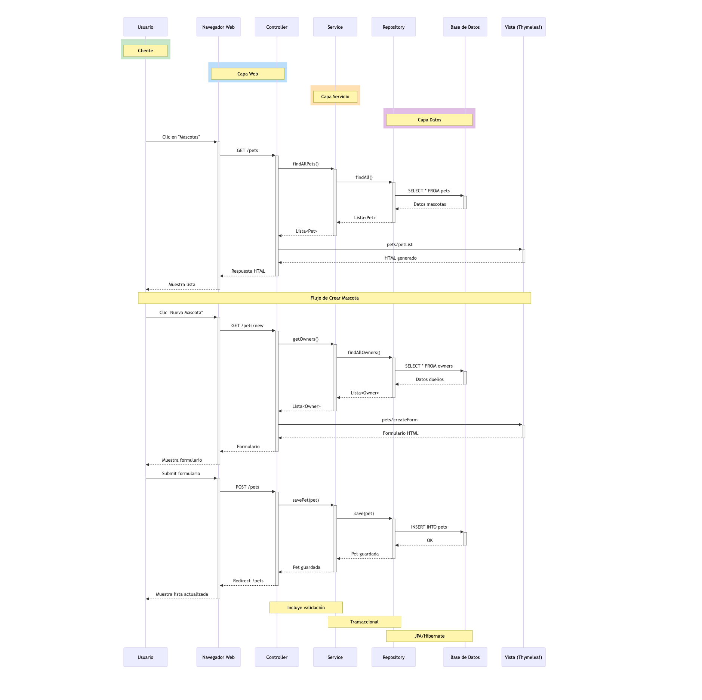

## Aplicación Pet Clinic 

Esta es una [versión dockerizada de la aplicación original](https://github.com/spring-projects/spring-petclinic) publicada por la comunidad de Spring Boot.

## Ejecutando la aplicación PetClinic localmente

Petclinic es una aplicación [Spring Boot](https://spring.io/guides/gs/spring-boot) construida usando Maven. Es una aplicación diseñada para mostrar cómo se puede usar el stack de Spring para construir aplicaciones simples pero poderosas orientadas a bases de datos. La versión oficial de PetClinic demuestra el uso de Spring Boot con Spring MVC y Spring Data JPA.

## ¿Cómo funciona?

Spring Boot trabaja con MVC (Modelo-Vista-Controlador), un patrón en el diseño de software comúnmente utilizado para implementar interfaces de usuario, datos y lógica de control. Enfatiza una separación entre la lógica de negocio y su visualización. Esta "separación de preocupaciones" proporciona una mejor división del trabajo y un mantenimiento mejorado. Podemos trabajar con la capa de persistencia o acceso a datos con [spring-data](https://spring.io/projects/spring-data) de una manera simple y muy rápida, sin la necesidad de crear tantas clases manualmente. Spring Data viene con métodos integrados por defecto que te permiten guardar, eliminar, actualizar y/o crear.

## Arquitectura de la Aplicación

La arquitectura de PetClinic sigue una estructura modular que facilita la separación de responsabilidades y el mantenimiento del código. Utiliza Spring Boot como marco principal, lo que permite una configuración simplificada y una integración fluida con otros componentes del ecosistema Spring. La aplicación está dividida en varias capas, incluyendo la capa de presentación, la capa de servicio y la capa de persistencia, cada una con responsabilidades claramente definidas.

## Funcionamiento

La aplicación PetClinic permite gestionar una clínica veterinaria, donde se pueden registrar y consultar dueños de mascotas, así como sus respectivas mascotas y visitas. Los usuarios pueden interactuar con la aplicación a través de una interfaz web, realizando operaciones CRUD (Crear, Leer, Actualizar, Eliminar) sobre los datos almacenados en la base de datos. La aplicación también incluye validaciones y manejo de errores para asegurar la integridad de los datos.

## Documentación del Proyecto

- [Cómo desplegar la aplicación de forma local](./docs/1-deploy-local.md)
- [Resultados](./docs/2-resultados.md)
- [Desafío](./docs/3-desafio.md)

## Mensaje Final

¡Mucho éxito en este desafío de aprendizaje! Este proyecto puede ser el inicio de muchos. A disfrutar el conocimiento.