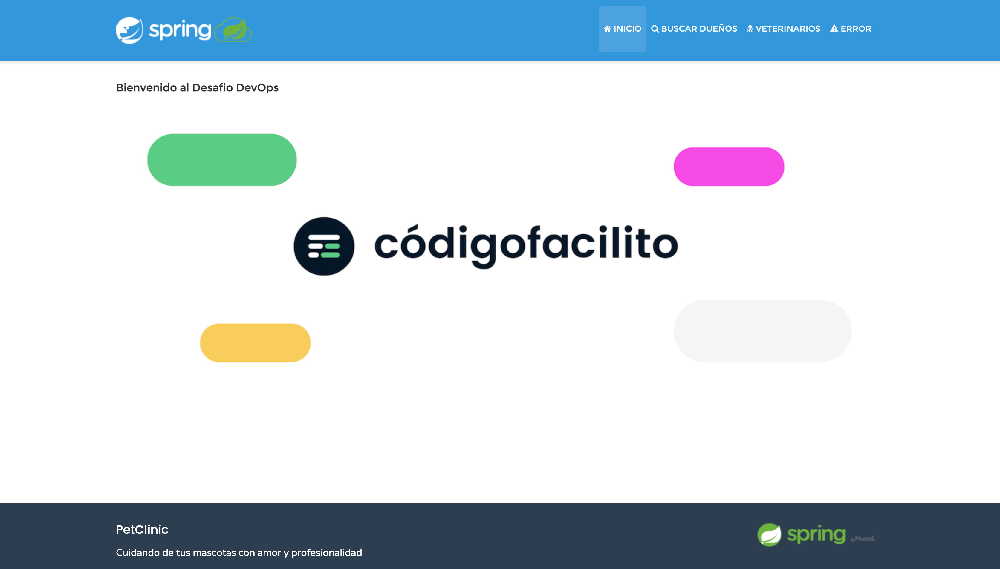
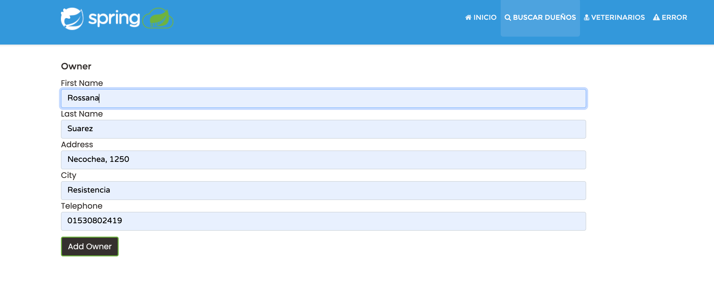
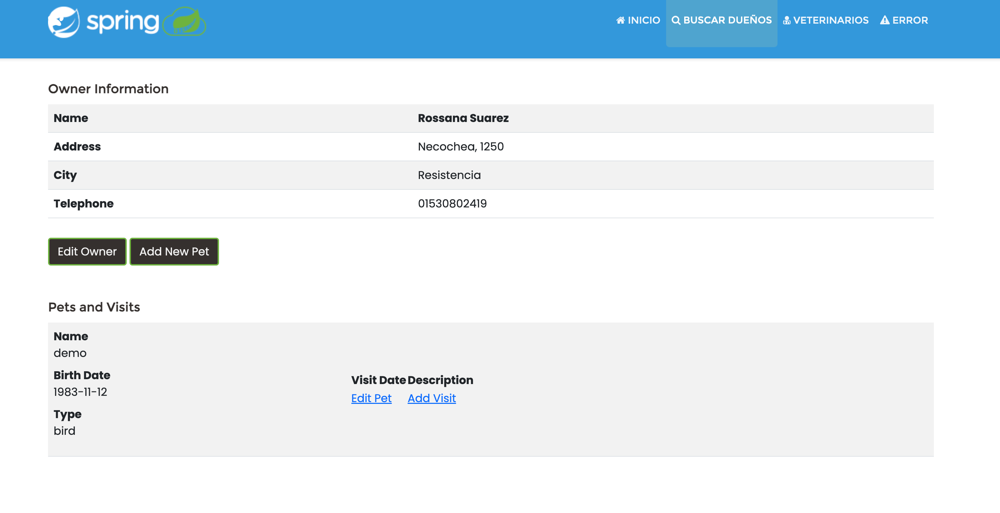
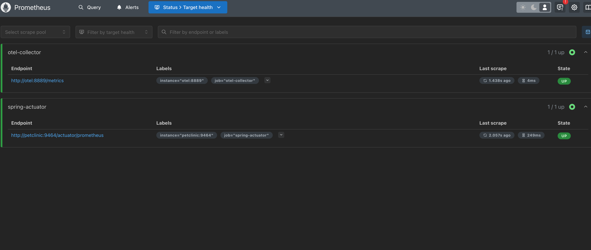
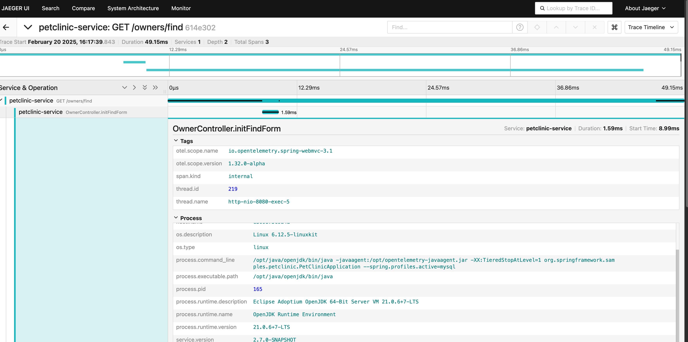
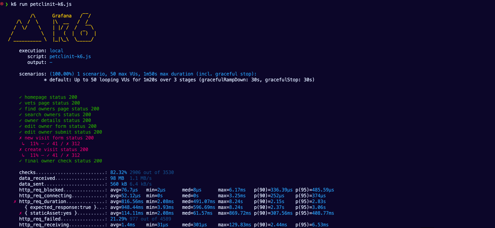
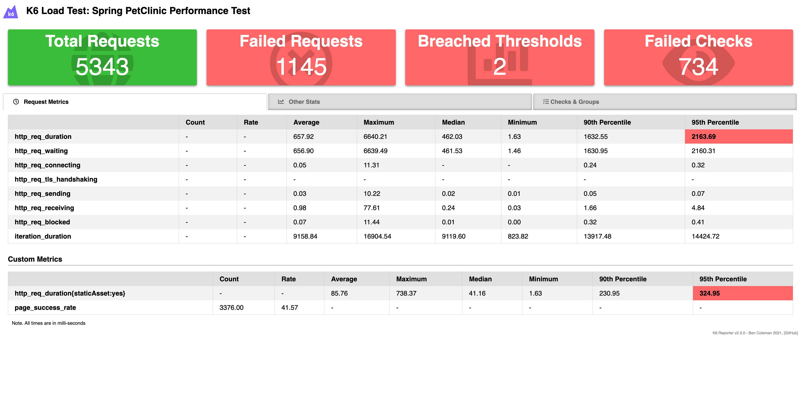

## Resultados del Despliegue Local

## Despliegue del Docker compose 
- `docker-compose.yml`: Servicios principales 

1. Desplegar servicios:

   ```bash
   docker compose -f docker-compose.yml up -d --build
   ```


## UI PetClinic
La interfaz de usuario de UI PetClinic es una aplicación web que permite a los usuarios interactuar con el sistema de gestión Veterinaria. 

Para acceder a la interfaz de usuario de UI PetClinic, visita: [UI PetClinic](http://localhost:8820)







## Observabilidad

### Prometheus



### Jaeger UI


## Pruebas de Carga

Para realizar pruebas de carga utilizamos la herramienta [k6](https://k6.io/), que permite simular múltiples usuarios interactuando con la aplicación para evaluar su rendimiento bajo condiciones de carga.

### Instalación de k6

Para instalar k6, puedes usar Homebrew en macOS:

```bash
brew install k6
```
En Linux, puedes instalar k6 utilizando el siguiente comando:

```bash
sudo apt update
sudo apt install k6
```
En otras plataformas, sigue las instrucciones de instalación en la [documentación oficial de k6](https://k6.io/docs/getting-started/installation/).

### Ejecución de Pruebas de Carga


1. Ejecutar el script de prueba:

Codigo [k6](../loadtesting/k6/petclinit-k6.js)

Revisar el endpoint de la Aplicación
   ```bash
      // Variables globales
      const PETCLINIC_HOST = __ENV.PETCLINIC_HOST || 'http://localhost:8080';
      const CONTEXT_WEB = __ENV.CONTEXT_WEB || '';
   ```

   ```bash
   k6 run petclinit-k6.js
   ```

2. Revisar los resultados en la consola para identificar posibles problemas de rendimiento.



> Que significa estos resultados?

Te explico los resultados de k6:

1. Configuración ejecutada:
   - Duración: 1m21.2s
   - VUs (Usuarios Virtuales): 5-50 usuarios
   - Escenarios: 3 etapas (rampa de subida, meseta, rampa de bajada)

2. Resultados de los checks:
   ```
   checks: 82.14% ✓ 3376 ✗ 734
   ```
   - 82.14% de éxito en las verificaciones
   - 3,376 checks exitosos
   - 734 checks fallidos
   - Problemas principales en:
     - `new visit form`: solo 10% de éxito (44/367)
     - `create visit`: solo 10% de éxito (44/367)

3. Rendimiento:
   ```
   http_req_duration: avg=657.92ms min=1.62ms med=462.02ms max=6.64s
   ```
   - Tiempo promedio de respuesta: 657.92ms
   - Tiempo mínimo: 1.62ms
   - Tiempo mediano: 462.02ms
   - Tiempo máximo: 6.64s
   - P95 (95% de las peticiones): 2.16s

4. Tasas de error:
   ```
   http_req_failed: 21.42% ✓ 1145 ✗ 4198
   ```
   - 21.42% de las peticiones fallaron
   - 1,145 fallos
   - 4,198 éxitos

5. Throughput:
   ```
   http_reqs: 5343 65.792044/s
   ```
   - Total de peticiones: 5,343
   - Tasa: ~66 peticiones por segundo

6. Rendimiento de assets estáticos:
   ```
   { staticAsset:yes }: avg=85.76ms
   ```
   - Tiempo promedio para recursos estáticos: 85.76ms
   - Significativamente más rápido que las peticiones dinámicas

🚩 Problemas detectados:
1. Alta tasa de fallos en la creación de visitas (90%)
2. Tiempo máximo de respuesta muy alto (6.64s)
3. 21.42% de tasa de error general
4. El P95 de 2.16s sugiere problemas de rendimiento bajo carga

✅ Aspectos positivos:
1. Buenos tiempos de respuesta para recursos estáticos
2. La mayoría de los endpoints principales funcionan bien
3. Buen throughput general (66 req/s)

Recomendaciones:
1. Investigar por qué fallan las operaciones de visitas
2. Optimizar los tiempos de respuesta largos
3. Implementar caché para mejorar los tiempos de respuesta
4. Considerar escalado horizontal si la carga aumenta

> Recomendación: Al desplegar en Kubernetes, es crucial gestionar adecuadamente los recursos y configurar el escalado automático. Esto asegura que la aplicación PetClinic pueda manejar variaciones en la carga de trabajo de manera eficiente. Utiliza `Horizontal Pod Autoscaler` para ajustar el número de pods en función del uso de CPU o memoria, y define límites de recursos para evitar el consumo excesivo que podría afectar a otros servicios.

3.- Generación de reportes HTML/JSON



Para más detalles sobre cómo escribir y ejecutar pruebas con k6, consulta la [documentación oficial](https://k6.io/docs/).


